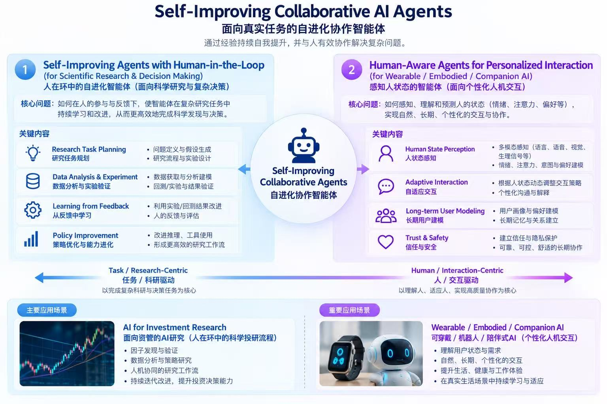

## Hi there 👋

### 🇬🇧 English

I'm an AI Researcher with an interdisciplinary background spanning **Cognitive Neuroscience (MS)** and **Computer Science (PhD)**.

My research focuses on **building self-improving AI agents for quantitative investment research**. I study how AI agents can autonomously conduct complex research tasks, continually improve through human feedback, and collaborate effectively with domain experts.

My long-term goal is to develop intelligent research systems that automate research workflows while combining autonomous reasoning, continual learning, and human expertise. Although my current application focuses on **investment research**, I am also interested in extending these methods to **scientific discovery** and other knowledge-intensive domains.

  

---

## Primary Research Interests

* 📈 **AI for Investment Research**  
  Developing self-improving AI agents for quantitative investment research, including financial reasoning, factor discovery, strategy research, backtesting, investment workflow automation, and decision support.

* 🔄 **Human-in-the-loop Agent Learning**  
  Developing continual learning methods that enable AI agents to improve through expert feedback, adaptive collaboration, and iterative research workflows.

* 🤖 **Self-Improving AI Agents**  
  Studying autonomous agents capable of planning, experimentation, memory, self-reflection, and continual improvement for complex research tasks.

---

## Secondary Research Interests

* 🔬 **AI for Scientific Discovery**  
  Extending self-improving research agents to scientific workflows, including hypothesis generation, experimental design, and automated research.

* 👤 **Human-Aware AI**  
  Exploring personalized AI systems through long-term user modeling, adaptive interaction, multimodal understanding, and trustworthy human–AI collaboration.

---

## Knowledge Base & Project Workspace

* 📚 **Obsidian Knowledge Base** A systematic knowledge system covering AI, Quantitative Finance, Software Development, and engineering methodologies.
  * 📖 **Book: Deep Dive in Python** — A long-term book project exploring Python execution mechanisms, advanced programming paradigms, memory management, concurrency, and software engineering.

* 🧠 **Obsidian Project Workspace** A project-oriented workspace for managing research, engineering, and practical projects from idea exploration to implementation, experimentation, and reflection.

  * 💡 **Agents for Factor Investment** — Building self-improving multi-agent systems for quantitative investment research and workflow automation.

  * 🧬 **Agents for LNP Discovery** — Applying AI agents to molecular design, screening, and formulation optimization of lipid nanoparticles.

  * 🤖 **Wearable Companion Robot** — A side project exploring human-aware AI for emotion regulation and sleep management.

---

## Hobbies

🎾 Tennis ｜ 🏸 Badminton ｜ 🎸 Electric Guitar ｜ 🤘 Rock

---

# 🇨🇳 中文

你好！我是一名 AI 研究员，拥有**认知神经科学（硕士）**和**计算机科学（博士）**的跨学科背景。

我的研究聚焦于**构建面向量化投资研究的自进化 AI 智能体（Self-Improving AI Agents）**，探索智能体如何自主完成复杂研究任务，并通过专家反馈持续学习，与人高效协作。

我的长期目标是构建能够自动完成复杂研究工作的智能体系统，将自主推理、持续学习和人类专业知识结合起来，加速科研与知识发现。目前，我主要关注**AI for Investment Research（人工智能驱动的投资研究）**，同时也希望将这些方法推广到**AI for Science（人工智能驱动的科学发现）**等知识密集型领域。

  

---

## 主要研究方向（Primary Research Interests）

* 📈 **AI for Investment Research｜人工智能驱动的投资研究**

  构建面向量化投资研究的自进化智能体系统，覆盖金融数据分析、因子挖掘、策略研究、回测验证、投研流程自动化以及投资决策支持。

* 🔄 **Human-in-the-loop Agent Learning｜人在环智能体学习**

  研究融合专家知识、人类反馈与人机协作的持续学习方法，使智能体能够在复杂研究任务中不断学习、自我优化。

* 🤖 **Self-Improving AI Agents｜自进化 AI 智能体**

  研究具备规划、实验、自我反思、长期记忆与持续学习能力的智能体系统，提升 AI 在复杂研究任务中的自主研究能力。

---

## 次要研究兴趣（Secondary Research Interests）

* 🔬 **AI for Scientific Discovery｜人工智能驱动的科学发现**

  将自进化研究智能体推广至科研场景，探索假设生成、实验设计、科研自动化以及科学发现等方向。

* 👤 **Human-Aware AI｜面向人的智能体系统**

  探索长期用户建模、多模态感知、自适应交互以及可信人机协作，为个性化 AI 与陪伴式智能体提供方法基础。

---

## 知识库与项目工作空间

* 📚 **Obsidian Knowledge Base（知识库）**： 构建涵盖 AI、量化金融、软件开发、金融以及工程实践的长期知识体系。

  * 📖 **《Deep Dive in Python》** —— 长期写作项目，系统梳理 Python 运行机制、高级编程范式、内存管理、并发架构以及软件工程实践。

* 🧠 **Obsidian Project Workspace（项目工作空间）**：用于管理研究课题、工程开发以及实践项目，覆盖从想法、调研、实现、实验到复盘的完整生命周期。

  * 💡 **Agents for Factor Investment** —— 构建面向量化投资研究的自进化多智能体系统，实现投研流程自动化。

  * 🧬 **Agents for LNP Discovery** —— 利用 AI Agent 加速脂质纳米颗粒（LNP）的分子设计、筛选与配方优化。

  * 🤖 **可穿戴陪伴机器人** —— 作为长期 Side Project，探索结合多模态生理感知、情感计算与个性化交互的人本智能体系统。

---

## 业余爱好

🎾 网球 ｜ 🏸 羽毛球 ｜ 🎸 电吉他 ｜ 🤘 摇滚
